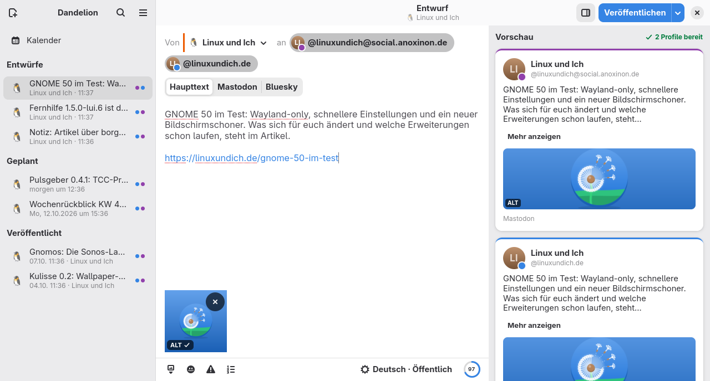
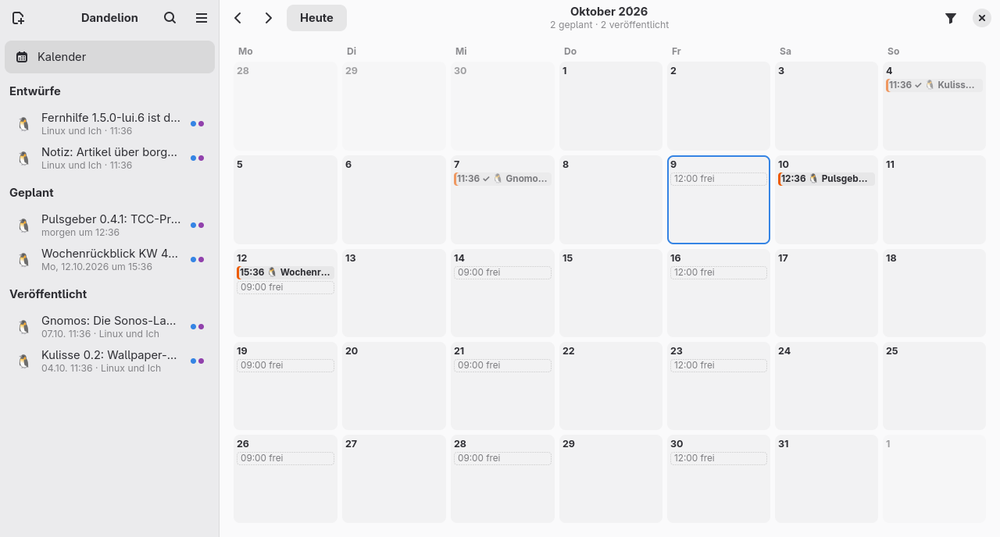
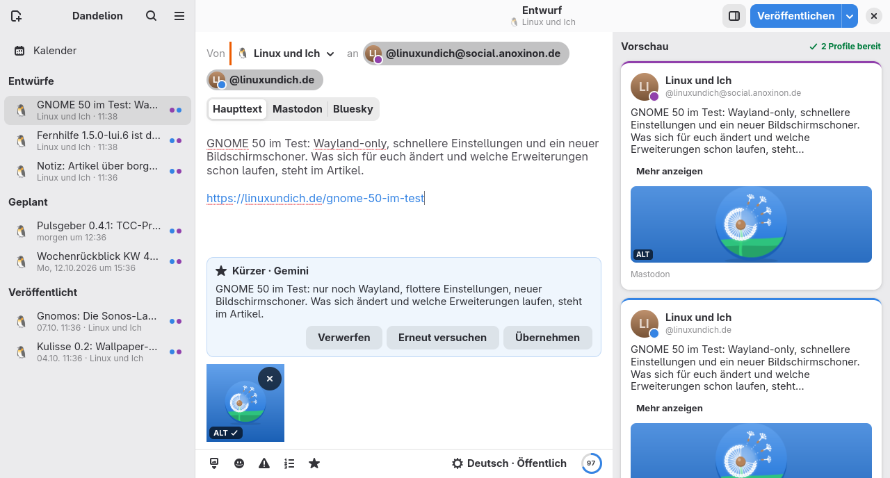

<div align="center">
  

  # Dandelion

  **Write once, post everywhere.**

  A native GNOME app to write a post once and publish it to Mastodon, Bluesky,
  LinkedIn, Facebook pages and X – right away or at a planned time.
</div>



## Features

- **Roles** bundle your profiles, language, visibility and a signature, for example
  “Private”, “Blog” or “Project”. One profile can belong to several roles.
- **Several accounts per network**, such as two Mastodon instances.
- **Exact character counters** for every network: Mastodon instance limits and
  23-character URLs, Bluesky graphemes and bytes, weighted counting for X.
- **Own wording** per network or per profile where needed; otherwise the main
  text is used.
- **Preview** for every profile. Profiles that would look the same share one
  tile, problems are shown right in the tile.
- **Alt text** is required for Mastodon and suggested everywhere else. The AI
  assistant (Gemini, OpenAI, Grok or OpenRouter, set up in the preferences) can draft it and
  revise it on request.
- **Threads:** long posts are split into numbered parts on Mastodon, Bluesky and
  X – at paragraphs, sentences or words, or by hand with a `---` line.
- **Scheduling** with a background service that also works while the window is
  closed. Missed posts (computer off or asleep) are reported instead of being
  sent silently. Mastodon posts can optionally be scheduled on the server.
- **One sidebar for everything:** drafts, scheduled and published posts sit in
  one list, grouped by state, with search and right-click actions.
- **Calendar and time slots:** a month view with scheduled and published posts
  and the free time slots of each role. Drag a draft from the sidebar onto a
  day to schedule it, or drag a scheduled post to another day.
- **History** with links to every post, retry for failed profiles and deletion
  on the platform.
- **Optional writing assistant** with Google Gemini, OpenAI, xAI or OpenRouter: rephrase,
  correct, translate, adapt to a network, suggest hashtags and describe images.
  It only makes suggestions and can be switched off completely.
- **Secure:** login data and API keys are stored in the system keyring
  (Secret Service), never in plain text.
- **Adaptive layout** from 360 px phones to wide desktop screens: the
  preview grows with the window and shows two columns when there is room.
  Keyboard shortcuts, light and dark style.

| Calendar | Writing assistant |
|---|---|
|  |  |

## Networks

| Network | Login | Notes |
|---|---|---|
| Mastodon | Browser (OAuth with PKCE) | Works with any Mastodon-compatible server |
| Bluesky | App password | Handles, profile addresses and own domains |
| LinkedIn | Own developer app | Personal profile only; a login is valid for 60 days |
| Facebook | Own developer app | Pages you manage only; no personal profiles or groups |
| X | Own developer app | **X charges per post** (about $0.015, $0.20 with a link) |

LinkedIn, Facebook and X only allow posting through an app that you register
yourself. Dandelion explains the steps when you add such a profile and shows
the redirect address to enter (`http://127.0.0.1:8742/callback`, for Facebook
`http://localhost:8742/callback`).

## Installation

### Arch Linux (AUR)

```bash
yay -S dandelion
```

The PKGBUILD lives in [`build-aux/arch/`](build-aux/arch/PKGBUILD).

### Flatpak

From a bundle (`dandelion-<version>-x86_64.flatpak`); the GNOME runtime is
fetched from Flathub automatically:

```bash
flatpak install --user dandelion-0.2.2-x86_64.flatpak
```

Build it yourself from the release tag, or from your working copy:

```bash
flatpak-builder --user --install --force-clean _flatpak build-aux/flatpak/de.linuxundich.Dandelion.release.json
flatpak-builder --user --install --force-clean _flatpak build-aux/flatpak/de.linuxundich.Dandelion.json
```

Create a bundle to share:

```bash
flatpak-builder --force-clean --repo=_flatpak-repo _flatpak build-aux/flatpak/de.linuxundich.Dandelion.release.json
flatpak build-bundle --runtime-repo=https://dl.flathub.org/repo/flathub.flatpakrepo \
    _flatpak-repo dandelion-0.2.2-x86_64.flatpak de.linuxundich.Dandelion master
```

The Flatpak keeps its own data and keyring entries, so profiles are added
again there.

### From source

Requirements: Python ≥ 3.12, PyGObject ≥ 3.50, GTK 4, libadwaita ≥ 1.8,
GtkSourceView 5, libspelling, libsoup 3, libsecret, libportal (GTK 4),
Meson and blueprint-compiler.

```bash
meson setup _build --prefix=/usr
meson compile -C _build
sudo meson install -C _build
```

## Scheduling

Planned posts must also be sent when Dandelion is closed:

- **Native installation:** a systemd user timer (`dandelion-scheduler.timer`)
  wakes up exactly at the next planned time and starts `dandelion --run-due`.
  No process runs in between. Enable it under *Preferences → Scheduling*.
- **Flatpak:** the Background portal starts Dandelion without a window after
  login while posts are planned.

## Privacy

Dandelion talks directly to the networks you use; there is no server in
between. The writing assistant is off by default. Before text or images are
sent to an AI provider for the first time, Dandelion asks for confirmation.

## Development

```bash
meson setup _build --prefix="$PWD/_install"
meson install -C _build
GSETTINGS_SCHEMA_DIR=_install/share/glib-2.0/schemas ./_install/bin/dandelion
python -m pytest tests
```

- `src/dandelion/core/` – data model, counting, validation, publisher,
  scheduler (no GTK, fully tested)
- `src/dandelion/platforms/` – one module per network behind a common interface
- `src/dandelion/ai/` – AI providers and prompts
- `src/dandelion/ui/` – Blueprint files
- `docs/` – research, concept and design notes (German)

### Translations

The interface is available in English and German. After changing strings:

```bash
meson compile -C _build dandelion-pot
python3 po/de_translations.py
```

## License

Dandelion is free software under the
[GNU General Public License, version 3 or later](COPYING).
